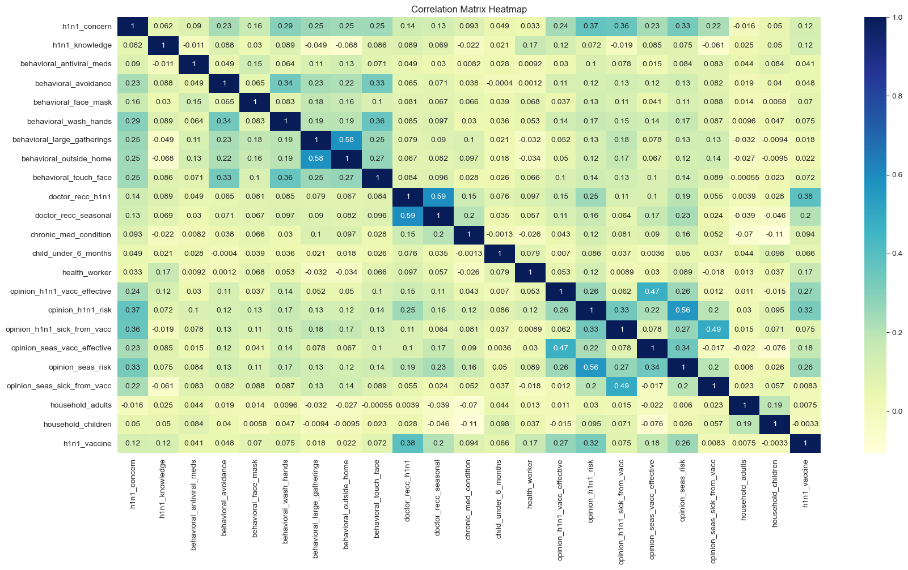
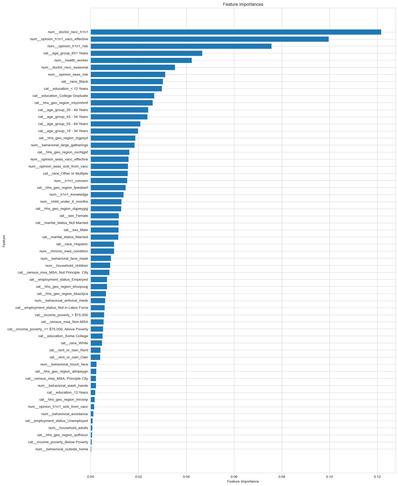

# Jacinta_Phase3

H1N1 Vaccination Uptake Prediction

Overview

This project aims to predict whether individuals received the H1N1 vaccine using data from the National 2009 H1N1 Flu Survey. The survey collected information on respondents' demographic, socio-economic, and attitudinal factors, as well as their health behaviors. Understanding these factors can provide insights for future public health efforts to improve vaccination rates.

Business Understanding

This project focuses on analyzing the H1N1 vaccination uptake among respondents of the National 2009 H1N1 Flu Survey. Vaccination is a crucial public health measure to combat infectious diseases, with the potential to achieve herd immunity. The survey data includes respondents' backgrounds, opinions, and health behaviors, allowing us to identify influential factors affecting vaccination decisions.
The primary challenges include handling a large dataset with missing values, identifying the most significant predictors of vaccination, and selecting the best machine learning model to accurately predict vaccination uptake.
To address these challenges, we developed and evaluated several machine learning models, including Decision Tree Classifier, Logistic Regression, Random Forest, K-Nearest Neighbors Classifier, and Gradient Boosting Classifier. We measured the models' performance using accuracy, precision, recall, and F1-score, aiming for an accuracy score of at least 80%.

Problem Statement

Vaccine hesitancy poses a significant challenge to public health efforts, leading to decreased immunization rates and increased vulnerability to infectious diseases. Understanding the factors influencing individuals' decisions regarding vaccine uptake is crucial for designing effective interventions and promoting community immunity. In this context, the project aims to predict the likelihood of individuals receiving the H1N1 flu vaccine using machine learning techniques and data from the National Flu Survey (NHFS 2009).

Objectives

1. To create a model that assess feature importance within the dataset, helping identify key factors to emphasize when promoting vaccination.

2. To determine the most influential factors affecting H1N1 vaccine acceptance, including doctor recommendations, perceptions of vaccine effectiveness, and risk perceptions related to H1N1.

3. To assess the performance of different machine learning algorithms, including Decision Tree Classifier, Logistic Regression, Random Forest, K-Nearest Neighborhood Classifier, and Gradient Boosting Classifier in predicting H1N1 vaccine uptake.

4. To analyze the implications of the predictive models and identify actionable insights for public health professionals and policymakers to improve vaccination rates.

Data Understanding

The dataset includes information on 26,707 respondents and 37 columns with features covering social, economic, and demographic backgrounds, opinions on risks of illness and vaccine effectiveness, and behaviors towards mitigating transmission.

Data Preparation

To address the issue of missing data in the H1N1 Flu Vaccines dataset, I developed a Python class called DataChecker that systematically handles various data preprocessing tasks. The initial steps involved loading the dataset and identifying missing values and duplicate rows. To clean the dataset, I implemented a method to drop specific columns that had a high percentage of missing values, as these columns (namely health_insurance, employment_industry, and employment_occupation) were not deemed essential for analysis.

For the remaining missing data, I took a two-pronged approach. First, I targeted the numeric columns by calculating the mean of each column and replacing the missing values with these means. This approach ensures that the numeric integrity of the data is maintained without introducing biases. For non-numeric columns, I replaced the missing values with the mode, which is the most frequently occurring value in each column. This method preserves the categorical nature of these columns and maintains the consistency of the data.

The DataChecker class included methods for these tasks, ensuring a modular and reusable code structure. After processing, I verified that the dataset had no remaining missing values, achieving a complete and clean dataset ready for further analysis. This comprehensive approach allowed for efficient data preprocessing, handling both numeric and categorical missing values appropriately, thus ensuring the integrity and usability of the dataset for subsequent analyses.

Data Analysis

This heatmap visualizes the relationships between various factors in a public health survey about H1N1 (swine flu). The color intensity indicates the strength and direction of the correlation. Positive correlations (dark blue) suggest that factors tend to increase or decrease. Conversely, negative correlations (beige) show opposing trends. There's a weak negative correlation between concern about H1N1 and the number of adults or children in the household, which might be due to a perceived lower risk or a focus on protecting others. These findings offer valuable insights into public health behaviors and opinions, but it's important to remember that correlation doesn't imply causation.

The most significant predictors include recommendations from doctors (num_doctor_recc_h1n1), opinions on the vaccine's effectiveness (num_opinion_h1n1_vacc_effective), and perceived risk of H1N1 (num_opinion_h1n1_risk). These factors likely highlight the importance of trusted medical advice and personal beliefs about the vaccine's benefits and risks in driving vaccination decisions. Conversely, the least significant predictors include behavioral factors like going outside the home (num_behavioral_outside_home), household adults (num_household_adults), and employment status (cat_employment_status_Unemployed)

Modelling

Algorithms Used:
Logistic Regression
Decision Tree Classifier
K-Nearest Neighbors Classifier
Random Forest
Gradient Boosting Classifier

The Decision Tree Classifier demonstrated an overall accuracy of 75%, with a precision of 0.85 and recall of 0.83 for class 0 (did not receive the vaccine). However, it struggled with class 1 (received the vaccine), achieving a precision of 0.42, recall of 0.45, and an F1-score of 0.44, resulting in a macro average F1-score of 0.64. In comparison, the K-Nearest Neighbors (KNN) Classifier performed better, achieving an overall accuracy of 81%, a macro average F1-score of 0.68, and higher precision and recall for both classes. Logistic Regression surpassed these models with an overall accuracy of 83%, and a macro average F1-score of 0.71, showing improved balance and effectiveness in handling class imbalances.

The Random Forest Classifier showed strong overall performance with an accuracy of 83%, a precision of 0.85, and a recall of 0.95 for class 0, but faced challenges with class 1, resulting in a macro average F1-score of 0.70. The Gradient Boosting Classifier outperformed all other models with an overall accuracy of 84%, achieving a macro average F1-score of 0.72. This model exhibited high precision (0.86) and recall (0.94) for class 0, and relatively better performance for class 1 with a precision of 0.68, recall of 0.45, and an F1-score of 0.54. These results indicate that the Gradient Boosting Classifier is the most effective model for predicting H1N1 vaccine uptake in this dataset.

Evaluation

The models were evaluated using accuracy, precision, recall, and F1-score. Gradient Boosting Classifier emerged as the top performer with the highest accuracy of 84% and balanced performance across both vaccinated and non-vaccinated classes. Logistic Regression and Random Forest also performed well, showing competitive accuracy but slightly less effectiveness in handling the minority class compared to Gradient Boosting. The Decision Tree and K-Nearest Neighbors models were less effective, particularly in managing class imbalance, with Decision Tree showing significant weaknesses in overall predictive power.

Conclusion

Our analysis identified significant predictors of H1N1 vaccination, such as doctor's recommendations, opinions on vaccine effectiveness, and perceived risk of H1N1. These insights underline the importance of medical advice and personal beliefs in vaccination decisions. 

Gradient Boosting Classifier proved to be the most effective model, achieving high accuracy and balanced performance, making it the preferred choice for this dataset. 

Recommendations

To improve H1N1 vaccination coverage, public health campaigns should target educational efforts towards higher education groups and develop tailored strategies for different ethnic demographics. Prioritizing vaccination awareness among older adults and leveraging medical advice and vaccine effectiveness in public health messaging are crucial. Implementing Gradient Boosting Classifier for vaccination prediction is recommended due to its superior performance, with Logistic Regression and Random Forest as viable backup options. Avoid using KNN and Decision Tree models in their current state due to lower accuracy and handling of class imbalance.

Future Work

Future work should focus on exploring additional feature engineering techniques to enhance model performance further. Investigating the impact of other demographic and behavioral factors not covered in this study can provide deeper insights. Applying the models to other datasets will help generalize findings and validate robustness. Additionally, further tuning and optimization of models are essential to improve predictive accuracy and ensure the models' applicability in various public health scenarios.

